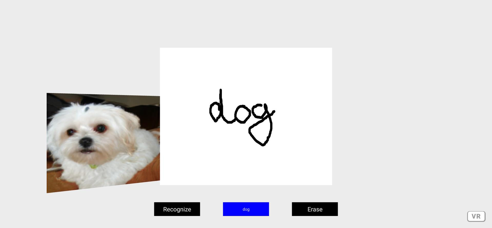

# Text Drawing and Recognition in A-Frame

### **Description / Rationale**
This is an exploratory project, which demonstrates the drawing and text recognition possibilities in web VR environment. Drawing part represents the reduced and slightly adapted version of Marlon Lückert's <a href="https://github.com/marlon360/whiteboard-vr">"Whiteboars VR"</a>. Text recognition part is made available through Microsoft’s TrOCR model, hosted on HuggingFace. Recognized text is turned into image through another AI model hosted on HuggingFace. 

### **Instructions**
To enable drawing component: 
1. Attach it to the head of your html file:  
2. Attach attribute of "texture-painter" to a disired primitive, i.e. plane: 
<a-plane texture-painter position="0 1.5 -4" rotation="0 0 0" width="5" height="4"></a-plane>. 
If necessary define the attribute parameters (color: color; background: color; size: numeric;  eraseAll: boolean), for example:
- texture-painter="color: green; background: red; size: 15";
3. Make sure to make primitive "texture-painter" is applied is clickable if used with VR or withouth if it is mobile or desktop:
VR: <a-plane texture-painter class="clickable" position="0 1.5 -4" rotation="0 0 0" width="5" height="4"></a-plane>. 
Mobile: <a-plane texture-painter position="0 1.5 -4" rotation="0 0 0" width="5" height="4"></a-plane>
4   
To see the project at work just copy the repository to your local server and explore all the functionality. For reference, please see original <a href="https://github.com/fernandojsg/aframe-gltf-exporter-component">AFrame GLTF Exporter Component.</a>

### **Tech Stack**
The project is powered by AFrame.

### **Demo**
To see the application at work: [Demo application](https://webvr-drawing.glitch.me/)
